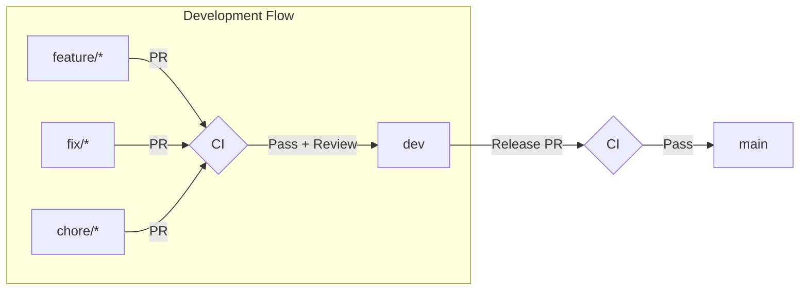

# Branching Strategy

This document explains the **rationale and rules** behind our branching model. For step-by-step commands and daily workflow, see [Git Workflow Guide](./git-workflow.md).

This repository uses a lightweight, production-oriented branching model designed for clarity, stability, and predictable deployments. It supports a linear commit history and a clean pull-request workflow that avoids merge commits and tangled histories.

## Index

- [Branch Types](#branch-types)
- [Branch Flow](#branch-flow)
- [Workflow Diagram](#workflow-diagram)
- [Updating Branches](#updating-branches)
- [Merging Rules](#merging-rules)
- [Branch Naming Conventions](#branch-naming-conventions)
- [Why This Strategy Works](#why-this-strategy-works)
- [Release Process Summary](#release-process-summary)
- [Release Process and Versioning](./release-process.md)

---

## Branch Types

### `main`
The stable, production-ready branch.

Rules:
- Always deployable
- Protected
- Linear history only
- Requires PRs, CI checks, and reviews

### `dev`
The integration branch where all features are combined and validated before release.

Rules:
- Protected with CI + linear history
- Rebases regularly on top of `main` (maintainers only)
- Receives all feature work through PRs

### `feature/*`
Short-lived development branches used for all coding work.

Examples:
```
feature/codepane-fix
feature/add-new-post
fix/lighthouse-warning
chore/update-ci
```

Rules:
- Created from `dev`
- Updated through rebasing
- Merged into `dev` via PR
- Deleted after merge

---

## Branch Flow

Feature development always flows forward:

```
feature/* → dev → main
```

No feature branch should ever merge directly into `main`.

---

## Workflow Diagram



> **Note:** This workflow uses "Rebase and Merge" exclusively — no merge commits. All PRs must pass CI checks before merging. The result is a clean, linear history on both `dev` and `main`.

---

## Updating Branches

All branches are kept up-to-date through rebasing (never merging):

- **Feature branches** rebase onto `dev` before opening a PR
- **`dev` branch** rebases onto `main` periodically to stay current (maintainers only)

> **Why rebase?** Rebasing replays your commits on top of the target branch, resulting in a linear history without merge commits. This makes the commit log easier to read, debug, and bisect.

For detailed commands, see the [Git Workflow Guide](./git-workflow.md#keeping-your-branch-updated).

---

## Merging Rules

### Feature → dev
- Must be rebased first
- CI checks required (ESLint, tests, build)
- "Rebase and Merge" only (no merge commits)
- PR should contain clear, cohesive work
- Code review approval required

### dev → main
- Performed when preparing a release
- Must be fully rebased on top of `main`
- CI checks required (ESLint, tests, build, Lighthouse)
- "Rebase and Merge" preferred to maintain linear history

For detailed CI requirements, see [CI Checks](./git-workflow.md#ci-checks) and [Reviewer Checklist](./git-workflow.md#reviewer-checklist).

---

## Branch Naming Conventions

Use lowercase, hyphen-separated names:

| Type | Pattern | Purpose |
|------|---------|---------|
| Feature | `feature/*` | New functionality |
| Fix | `fix/*` | Bug fixes |
| Chore | `chore/*` | Non-feature tasks (CI, tooling, configs) |
| Refactor | `refactor/*` | Internal improvements |

Examples:
```
feature/add-responsive-layout
fix/header-overflow
chore/update-eslint-config
refactor/api-client
```

---

## Why This Strategy Works

- Prevents merge bubbles
- Keeps history linear and easy to follow
- Ensures `main` is always production-ready
- Encourages frequent rebasing and clean integration
- Makes debugging and bisecting much easier
- CI becomes predictable and effective

---

## Release Process Summary

1. Ensure `dev` is stable
2. Rebase `dev` onto `main`
3. Create PR: `dev` → `main`
4. Merge via "Rebase and Merge"
5. Deployment to production triggers automatically (if configured)

> **Tip:** Prefer small, frequent releases over large batches. This reduces merge conflict risk and makes rollbacks easier if issues arise.

For detailed release steps and versioning, see [Release Process and Versioning](./release-process.md).
