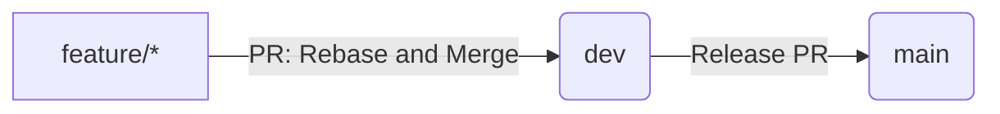

# Git Workflow Guide

This guide provides **step-by-step commands** for working with this repository's Git workflow. For the strategic overview and rationale, see [Branching Strategy](./branching-strategy.md).

This project uses a linear-history, rebase-first workflow designed to keep `main` clean, stable, and production-ready while allowing active development on `dev` and feature branches.

## Index

- [Branch Roles](#branch-roles)
- [Workflow Overview](#workflow-overview)
- [Creating a New Feature Branch](#creating-a-new-feature-branch)
- [Working on Your Feature Branch](#working-on-your-feature-branch)
- [Keeping Your Branch Updated (Rebasing)](#keeping-your-branch-updated-rebasing)
- [Opening a Pull Request](#opening-a-pull-request)
- [Keeping the `dev` Branch Clean](#keeping-the-dev-branch-clean)
- [Releasing to Production](#releasing-to-production)
- [Cheat Sheet](#cheat-sheet)
- [Principles of This Workflow](#principles-of-this-workflow)
- [Example Commit History (Ideal)](#example-commit-history-ideal)

---

## Branch Roles

### `main`
- Always stable  
- Always deployable  
- Protected (requires PR, status checks, linear history)

### `dev`
- Integration branch  
- All work from feature branches merges into `dev`  
- Also protected with CI + linear history  

### `feature/*`, `fix/*`, `chore/*`, `refactor/*`
- Short-lived development branches  
- Created from `dev`  
- Merged into `dev` through PR  
- Deleted after merge

> See [Branch Naming Conventions](./branching-strategy.md#branch-naming-conventions) for detailed naming patterns.  

---

## Workflow Overview



---

## Creating a New Feature Branch

Always start from the latest `dev`:

```sh
git checkout dev
git pull
git checkout -b feature/my-new-feature
```

---

## Working on Your Feature Branch

Commit changes normally:

```sh
git add .
git commit -m "feat: implement X"
```

---

## Keeping Your Branch Updated (Rebasing)

Before opening a pull request, rebase your branch onto the latest `dev`:

```sh
git checkout dev
git pull
git checkout feature/my-new-feature
git rebase dev
```

If conflicts appear:

```sh
# Fix files manually
git add .
git rebase --continue
```

To cancel a rebase:

```sh
git rebase --abort
```

> **Important:** If you've already pushed your branch before rebasing, you must force push afterward:
>
> ```sh
> git push --force-with-lease
> ```
>
> Always use `--force-with-lease` instead of `--force` — it prevents overwriting commits pushed by others.

---

## Opening a Pull Request

When your feature is ready:

1. Push your branch:
   ```sh
   git push --set-upstream origin feature/my-new-feature
   ```
2. Open a Pull Request into `dev`  
3. Ensure CI checks pass  
4. Reviewer merges using **Rebase and merge**

> **Note:** If "Rebase and merge" is not available, a repository admin must enable it in **Settings → General → Pull Requests**.  

---

## Keeping the `dev` Branch Clean

> **Maintainers only:** Rebasing `dev` rewrites shared history. Only maintainers should perform this operation, and only after coordinating with the team.

Maintainers periodically update `dev`:

```sh
git checkout dev
git pull
```

If history becomes messy, perform a rebase from `main`:

```sh
git checkout main
git pull
git checkout dev
git rebase origin/main
git push --force-with-lease
```

---

## Releasing to Production

When `dev` is stable:

1. Open a PR from `dev` → `main`  
2. Ensure all checks pass  
3. Merge using **Rebase and merge**  
4. CI deploys automatically (if configured)  

---

## Cheat Sheet

**Common Commands**

```sh
git checkout -b feature/x         # create branch
git fetch origin                  # fetch latest data
git rebase origin/dev             # update feature branch
git push --force-with-lease       # safe force push
git rebase --continue             # after fixing conflicts
git rebase --abort                # cancel rebase
```

---

## Principles of This Workflow

- `main` is always deployable  
- `dev` is always up-to-date and integrates all ongoing work  
- Feature branches are short-lived  
- Rebasing keeps history linear and readable  
- CI + protections maintain code quality  

---

## Example Commit History (Ideal)

```
* feat: add user onboarding
* fix: correct typo in auth flow
* chore: update dependencies
* feat: implement dashboard charts
```

No merge bubbles. No noise — clean and linear.
