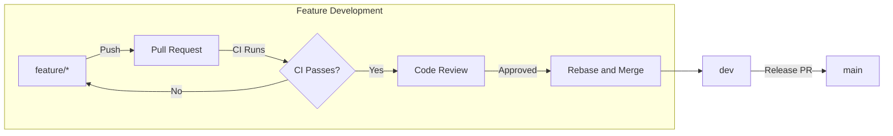

# Git Workflow Guide

This guide provides **step-by-step commands** for working with this repository's Git workflow. For the strategic overview and rationale, see [Branching Strategy](./branching-strategy.md).

This project uses a linear-history, rebase-first workflow designed to keep `main` clean, stable, and production-ready while allowing active development on `dev` and feature branches.

## Index

- [Branch Roles](#branch-roles)
- [Workflow Overview](#workflow-overview)
- [Creating a New Feature Branch](#creating-a-new-feature-branch)
- [Working on Your Feature Branch](#working-on-your-feature-branch)
- [Keeping Your Branch Updated](#keeping-your-branch-updated)
- [When NOT to Rebase](#when-not-to-rebase)
- [Recovering From Rebase Mistakes](#recovering-from-rebase-mistakes)
- [Opening a Pull Request](#opening-a-pull-request)
- [CI Checks](#ci-checks)
- [Reviewer Checklist](#reviewer-checklist)
- [Keeping the `dev` Branch Clean](#keeping-the-dev-branch-clean)
- [Releasing to Production](#releasing-to-production)
- [Advanced Scenarios](#advanced-scenarios)
- [Cheat Sheet](#cheat-sheet)
- [FAQ and Troubleshooting](#faq-and-troubleshooting)

---

## Branch Roles

### `main`
- Always stable  
- Always deployable  
- Protected (requires PR, status checks, linear history)

### `dev`
- Integration branch  
- All work from feature branches merges into `dev`  
- Also protected with CI + linear history  

### `feature/*`, `fix/*`, `chore/*`, `refactor/*`
- Short-lived development branches  
- Created from `dev`  
- Merged into `dev` through PR  
- Deleted after merge

> See [Branch Naming Conventions](./branching-strategy.md#branch-naming-conventions) for detailed naming patterns.

---

## Workflow Overview



---

## Creating a New Feature Branch

Always start from the latest `dev`:

```sh
git checkout dev
git pull
git checkout -b feature/my-new-feature
```

> **Tip:** Use the appropriate prefix for your work type:
> - `feature/` — New functionality
> - `fix/` — Bug fixes
> - `chore/` — Non-feature tasks (CI, tooling, configs)
> - `refactor/` — Internal improvements

---

## Working on Your Feature Branch

Commit changes normally using [conventional commit](https://www.conventionalcommits.org/) messages:

```sh
git add .
git commit -m "feat: implement user dashboard"
```

**Commit message prefixes should match your branch type:**

| Branch Type | Commit Prefix | Example |
|-------------|---------------|---------|
| `feature/*` | `feat:` | `feat: add login form` |
| `fix/*` | `fix:` | `fix: resolve null pointer` |
| `chore/*` | `chore:` | `chore: update dependencies` |
| `refactor/*` | `refactor:` | `refactor: simplify auth logic` |

---

## Keeping Your Branch Updated

Before opening a pull request, rebase your branch onto the latest `dev`:

```sh
git checkout dev
git pull
git checkout feature/my-new-feature
git rebase dev
```

If conflicts appear:

```sh
# Fix files manually
git add .
git rebase --continue
```

To cancel a rebase:

```sh
git rebase --abort
```

> **Important:** If you've already pushed your branch before rebasing, you must force push afterward:
>
> ```sh
> git push --force-with-lease
> ```
>
> Always use `--force-with-lease` instead of `--force` — it prevents overwriting commits pushed by others.

---

## When NOT to Rebase

Rebasing rewrites commit history. **Avoid rebasing in these situations:**

| Situation | Why | What to Do Instead |
|-----------|-----|-------------------|
| Branch others are working on | Rewrites their history, causes conflicts | Coordinate with team first |
| After PR is opened and reviewed | Invalidates review comments, confuses reviewers | Push new commits instead |
| `main` or `dev` branches | Affects all contributors | Only maintainers, with coordination |
| You're unsure what you're doing | Risk of losing work | Ask for help first |

> **Rule of thumb:** Only rebase commits that haven't been shared with others, or coordinate with your team before rebasing shared branches.

---

## Recovering From Rebase Mistakes

If a rebase goes wrong, don't panic. Git keeps a record of all changes in the reflog.

### Find Your Pre-Rebase State

```sh
git reflog
```

Look for the commit before the rebase started (usually labeled with your last action before `rebase`):

```
a1b2c3d HEAD@{0}: rebase (finish): returning to refs/heads/feature/x
e4f5g6h HEAD@{1}: rebase (pick): feat: add feature
i7j8k9l HEAD@{2}: rebase (start): checkout dev
m0n1o2p HEAD@{3}: commit: feat: add feature  ← This is your pre-rebase state
```

### Restore to Pre-Rebase State

```sh
git reset --hard HEAD@{3}  # Use the correct reflog reference
```

### If You Already Force Pushed

If you've already pushed the bad rebase:

```sh
git reset --hard HEAD@{3}
git push --force-with-lease
```

> **Prevention tip:** Before rebasing, create a backup branch: `git branch backup-feature-x`

---

## Opening a Pull Request

When your feature is ready:

1. Push your branch:
   ```sh
   git push --set-upstream origin feature/my-new-feature
   ```
2. Open a Pull Request into `dev` (never directly to `main`)
3. Ensure CI checks pass
4. Request review from a team member
5. Reviewer merges using **Rebase and Merge**

> **Note:** If "Rebase and Merge" is not available, a repository admin must enable it in **Settings → General → Pull Requests**.

---

## CI Checks

When we say "ensure CI checks pass," these are the specific checks that run:

| Check | Command | What It Validates |
|-------|---------|-------------------|
| **ESLint** | `npm run lint` | Code style, zero warnings policy |
| **Tests** | `npm test` | Unit tests pass (Vitest) |
| **Build** | `npm run build` | Production build succeeds |
| **Lighthouse** | Automated | Performance and accessibility audits |

All checks must pass before a PR can be merged.

---

## Reviewer Checklist

When reviewing a PR, verify:

- [ ] **Code quality:** Follows project conventions and patterns
- [ ] **Tests:** New/modified code has appropriate test coverage
- [ ] **Scope:** Changes are focused; no unrelated modifications
- [ ] **Commits:** Messages follow conventional format (`feat:`, `fix:`, etc.)
- [ ] **Rebased:** Branch is up-to-date with latest `dev`
- [ ] **CI:** All checks pass
- [ ] **No secrets:** No API keys, tokens, or sensitive data committed

When approving, use **Rebase and Merge** (not "Squash" or "Create a merge commit").

---

## Keeping the `dev` Branch Clean

> **Maintainers only:** Rebasing `dev` rewrites shared history. Only maintainers should perform this operation, and only after coordinating with the team.

Maintainers periodically update `dev`:

```sh
git checkout dev
git pull
```

If history becomes messy, perform a rebase from `main`:

```sh
git checkout main
git pull
git checkout dev
git rebase origin/main
git push --force-with-lease
```

---

## Releasing to Production

When `dev` is stable:

1. Open a PR from `dev` → `main`
2. Ensure all checks pass
3. Merge using **Rebase and Merge**
4. CI deploys automatically (if configured)

---

## Advanced Scenarios

### Cherry-Picking Commits

Use cherry-pick when you need to apply a specific commit to another branch (e.g., applying a critical fix to `dev` that was made on a feature branch):

```sh
git checkout dev
git cherry-pick <commit-hash>
```

**When to use:**
- Applying a hotfix across branches
- Extracting a single commit from a larger branch

**Caution:** Cherry-picking creates a duplicate commit with a different hash. Avoid cherry-picking commits that will later be merged normally, as this creates redundant history.

### Amending Your Last Commit

If you need to fix your most recent commit (typo, forgot a file):

```sh
git add <forgotten-file>
git commit --amend --no-edit
```

To also change the commit message:

```sh
git commit --amend -m "feat: corrected message"
```

> **Note:** Only amend commits that haven't been pushed, or be prepared to force push.

### Interactive Rebase (Squashing Commits)

To clean up multiple small commits before PR:

```sh
git rebase -i HEAD~3  # Review last 3 commits
```

In the editor, change `pick` to `squash` (or `s`) for commits you want to combine:

```
pick a1b2c3d feat: add login form
squash e4f5g6h fix: typo
squash i7j8k9l fix: another typo
```

---

## Cheat Sheet

**Common Commands**

```sh
git checkout -b feature/x         # Create branch
git fetch origin                  # Fetch latest data
git rebase origin/dev             # Update feature branch
git push --force-with-lease       # Safe force push
git rebase --continue             # After fixing conflicts
git rebase --abort                # Cancel rebase
git reflog                        # View history of HEAD changes
git reset --hard HEAD@{n}         # Restore to reflog entry
git cherry-pick <hash>            # Apply specific commit
git commit --amend                # Modify last commit
```

---

## FAQ and Troubleshooting

### "I accidentally committed to `main` or `dev`"

Move your commits to a new branch:

```sh
# Create a branch with your commits
git branch feature/my-work

# Reset the protected branch to origin
git reset --hard origin/main  # or origin/dev

# Switch to your new branch
git checkout feature/my-work
```

### "My PR shows merge conflicts"

Rebase your branch onto the latest `dev`:

```sh
git checkout dev
git pull
git checkout feature/my-branch
git rebase dev
# Fix conflicts, then:
git add .
git rebase --continue
git push --force-with-lease
```

### "I need to undo my last commit"

**Keep changes (unstage):**
```sh
git reset --soft HEAD~1
```

**Discard changes completely:**
```sh
git reset --hard HEAD~1
```

### "I pushed something I shouldn't have"

If you haven't shared the branch:
```sh
git reset --hard HEAD~1
git push --force-with-lease
```

If others have pulled:
```sh
git revert <commit-hash>
git push
```

### "Rebase went wrong, how do I recover?"

See [Recovering From Rebase Mistakes](#recovering-from-rebase-mistakes) above.

### "What's the difference between `--force` and `--force-with-lease`?"

- `--force` overwrites remote regardless of what's there
- `--force-with-lease` fails if someone else pushed commits you don't have

**Always use `--force-with-lease`** — it's a safety net.

---

## Principles of This Workflow

- `main` is always deployable
- `dev` is always up-to-date and integrates all ongoing work
- Feature branches are short-lived
- Rebasing keeps history linear and readable
- CI + protections maintain code quality

---

## Example Commit History (Ideal)

```
* feat: add user onboarding
* fix: correct typo in auth flow
* chore: update dependencies
* feat: implement dashboard charts
```

No merge bubbles. No noise — clean and linear.
